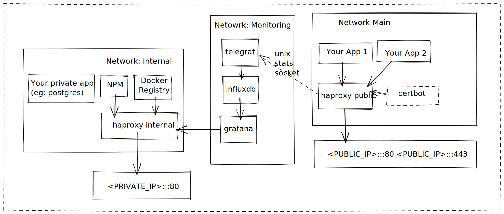

# Shoe-string cluster
* [Introduction](#introduction)
* [Guiding principals](#guiding-principals)
* [Contributing](#contributing)
* [Features](#features)
* [Considerations](#considerations)
* [Setup](#setup)
* [Usage / Scripts reference](#usage--scripts-reference)
  + [`./config.sh`](#configsh)
  + [`./start.sh`](#startsh)
  + [`./stop.sh`](#stopsh)
  + [`./proxy/reload-haproxy-config.sh`](#proxyreload-haproxy-configsh)
  + [`./applications/watchdog-up.sh`](#applicationswatchdog-upsh)
  + [`./ssl/*`](#ssl)
* [Accessing internal services](#accessing-internal-services)
  + [VPN Wireguard example](#vpn-wireguard-example)
  + [SSH Tunnel example](#ssh-tunnel-example)
* [Core Services](#core-services)
  + [Influxdb](#influxdb)
  + [Telegraf](#telegraf)
  + [HAProxy](#haproxy)
    - [haproxy-public-ssl](#haproxy-public-ssl)
* [Default internal services](#default-internal-services)
  + [Grafana](#grafana)
  + [Docker Registry (`registry:2`)](#docker-registry-registry2)
  + [NPM Registry (`verdaccio`)](#npm-registry-verdaccio)
    * [TODO:](#todo)
* [Future / TODO](#future--todo)

## Introduction

This project is an attempt to create a turn-key "cluster" that is suitable for
small servers with limited RAM.

The only OS level dependencies it needs to be operated are `docker` and `docker-compose`
and I use it on a AWS Lightsail host with 1GB of RAM.

I wrote this after attempting to get "light weight" kubernetes environments going like K3s
or KIND, and finding that the resource overhead was simply too high for my requirements 
(`512mb` minimum, `1gb` recommended)

**Current architecture**


## Guiding principals
- Every application runs in a `docker` container

- All configuration and data is stored under a single directory structure, to make backups simple

- Portable across different cloud providers, minimal host pre-requisites

- Provides the software that I typically want available to me when experimenting with personal projects 
  (eg: `npm` registry, `postgres` instance)

## Contributing
I welcome feedback and improvements, especially around any security concerns. However please note,
this project is pretty particular to my personal preferences and needs - I hope it might be of use
to others, but I might not accept PR's that don't align with my requirements. 

Please feel free to fork and customize to your hearts desire though :) 

## Features
- Public ingress on port 80 using haproxy

- Internal/private service ingress on configured port and ip address using haproxy
  - I recommend using `wireguard` or similar to bind this to a private ip address

- Private Docker registry

- Private NPM registry

- Metrics collected by `telegraf` to `influxdb`, with `grafana` for dashboards

- Letsencrypt certbot for automatic SSL provisioning, and renewal

- "Watchdog" script suitable for running on demand, or as `CronJob` to reconcile
  running applications with the configuration on filesystem

- Helper scripts for updating application configuration with new docker tags to
  deploy

## Considerations
- Letsencrypt will ban domains that make invalid requests to its production environment
  it's worthwhile testing this part of things using their staging environment before running

- This is held together with string, a collection of bash scripts that may or may not be portable,
  it has been tested on Fedora 34 and AWS Linux 2.
  
- Whilst every effort is made to limit RAM consumption, you may still want to add swap to avoid OOM killer. Influxdb
  in particular can consume a fair chunk of RAM. Instructions here: https://aws.amazon.com/premiumsupport/knowledge-center/ec2-memory-swap-file/

## Setup
1. Clone repo to somewhere on host or otherwise place the contents on the server
2. Install `docker` / `docker-compose` (`./init/install-dependencies.sh`, or manually)
3. Bootstrap data/configuration structure using `./init/create-empty-configuration-structure.sh /path/you/want/config-and-data-to-be-stored`
4. Configure generated files
   1. Update config.sh with correct ip addresses, ports etc
   2. Add, remove, or customise applications in `applications-internal` / `applications-public`
5. Run ./start.sh

## Usage / Scripts reference
There are a number of bash scripts in this project, I give a brief overview below,
but you should probably read through them before attempting to use in production.

### `./config.sh`
- Contains the path to the configuration directory. Generated by `./init/create-empty-configuration-structure.sh`

### `./start.sh`
- Generates haproxy configuration
- Creates the docker networks
- Start services defined in `docker-compose.yaml`
- Starts application using `applications/watchdog-up.sh`

### `./stop.sh`
- Stop services defined in `docker-compose.yaml`
- Stop applications using `applications/watchdog-down.sh`
- Clean up unused networks

### `./proxy/reload-haproxy-config.sh`
- Called automatically by `start.sh` and ssl certificate scripts
- Re-generates `haproxy.cfg` files, and sends a signal to the containers to reload their config.
- Can be called manually if changes to the template or applications yaml files have been made

### `./applications/watchdog-up.sh`
- Suitable for calling as a `CronJob` or manually after making changes to the application yaml
  configuration files, attempts to reconcile running containers with the configuration state.

### `./ssl/*`

TODO: write documentation

## Accessing internal services
There are two main options for configuring this securely:
- Bind to private ip address and access via VPN
- Bind to localhost / **firewalled** port and access via SSH tunnel

**Note:** these services are only exposed over `http` but I might add support for
exposing them over `https` as well since `docker` in particular gets a bit naggy about "insecure"
registries. It is assumed that you will only make them accessible via secure channels
like the examples below.

### VPN Wireguard example
**Prerequisites:** `wireguard-tools` installed, Linux kernel >= 5.6 or `wireguard` installed as a kernel module.
If you're not using Linux on both ends then you'll need to consult your platforms documentation.

1. On both host and client generate public/private key pairs:
   (you'll want to delete these files at the end)
 ```shell
wg genkey | tee privatekey | wg pubkey > publickey
```

2. Create server config:

Create file /etc/wireguard/wg0.conf:
 ```shell
[Interface]
Address = 10.12.0.1
PrivateKey = <SERVER_PRIVATE_KEY>
ListenPort = 51820

[Peer]
PublicKey = <CLIENT_PRIVATE_KEY>
AllowedIPs = 10.12.0.1/24
```
3. Open port `51820` on your servers firewall

4. Bring interface up on server
```shell
sudo wg-quick up wg0
sudo systemctl enable wg-quick@wg0 # optional, enable bringing up at boot-time
```

5. Create client config

Create file /etc/wireguard/wg0.conf:
 ```shell
 [Interface]
Address = 10.12.0.2
PrivateKey = <CLIENT_PRIVATE_KEY>

[Peer]
PublicKey = <SERVER_PUBLIC_KEY>
Endpoint = <SERVER_PUBLIC_IP>:51820
AllowedIPs = 10.12.0.2/24

PersistentKeepalive = 25
```

6. Bring interface up on client and test
```shell
sudo wg-quick up wg0
sudo systemctl enable wg-quick@wg0 # optional, enable bringing up at boot-time
ping 10.12.0.1
```

### SSH Tunnel example
**Assumptions:** ingress configured to 127.0.0.1:8080

Create tunnel using ssh, eg:
```shell
ssh user@host.com -L 127.0.0.1:8080:127.0.0.1:8080
```

Then services are available via port 8080, with the domains configured in the `haproxy-internal/applications.js`
file. The easiest way to make this available in your browser is to add entries to your
hosts file, or use something like `dnsmasq`

Eg: `/etc/hosts` file
```shell
127.0.0.1   grafana.internal.example.com
127.0.0.1   npm.internal.example.com
127.0.0.1   docker.internal.example.com
```

## Core Services
There are a number of "core" services managed by `docker-compose`. This is distinct from application services
that you want to deploy and make available.

### Influxdb
This is a time series database used by `telegraf` / `grafana` to collect and display metrics
about the host system, and public proxy.

By default, authentication is disabled. For production environments it probably makes sense to enable
authentication, and adjust the `telegraf` / `grafana` configuration as appropriate.

You may wish to customise the rentention policy and add continous queries to downsample your data,
refer to https://docs.influxdata.com/influxdb/v1.7/guides/downsampling_and_retention/ for help with this.

Start a influx shell using:
```shell
docker exec -it monitoring_influxdb influx
```

### Telegraf
This is the agent that collects metrics from the system and stores them in `influxdb`.

The default configuration should be a good baseline, and you can of course configure this as
required after bootstrapping your instance, in `/path/to/config/telegraf/telegraf.conf`

Refer to the manual at https://docs.influxdata.com/telegraf/v1.18/administration/configuration/

### HAProxy
There are two instances of haproxy in use, one for public ingress, and one for private/internal ingress.

The configuration is generated the docker-compose yaml files in the `applications-public` / `applications-internal`
directories. Specifically:

- A custom top level property `x-external-host-names` is used to know which vhosts to proxy
  to that application.

- A service named `application` is expected to exist, and the `hostname` of this is used to
  know which container to proxy to.

- A custom top level property `x-container-port` is used to know which port to proxy to, or
  default to 80.

If there are no external host names declared, or no application service is found, the file 
is skipped, and not included in the proxy.

Any customizations you need to make should be made to the template rather to avoid them
being overwritten.

The public proxy exposes stats using a unix socket, mounted to `haproxy-public-stats` and 
read from by telegraf.

For the public ingress, SSL certificates are read from `haproxy-public-ssl`, noting that haproxy
requires the public and private portion to be stored in the same file.

Originals are managed by certbot and stored in `letsencrypt/etc`

#### haproxy-public-ssl
This folder is where the concatenated ssl certificate + private keys will be
stored, and loaded by the public facing haproxy instance.

Due to an annoying "feature" of haproxy where it will refuse to start if this
directly is empty, which is likely is when first bootstrapping your server,
there is a `invalid.pem` file which contains a self-signed certificate for the
domain `invalid.`

This avoids the chicken and egg situation where you either need to first start
with ssl disabled then restart after certificates have been populated, etc

As per [RFC 6761](https://datatracker.ietf.org/doc/html/rfc6761) section 6.4,
`invalid.` is guaranteed to never exist, and once you have your own certificates
in this folder, it is safe to delete this placeholder certificate.

## Default internal services
The configuration template defines some default internal services, including:
- Grafana (dashboards / monitoring)
- Private NPM Registry (`verdaccio`)
- Private Docker Registry (`registry:2`)

**You'll need to modify the external hostnames in the yaml files to suit your environment**

**Disabling a service:** simply delete it's yaml file from `applications-internal`

### Grafana
At first start you will need to configure grafana with a connection to the influxdb datasource, and
create / import some dashboards.

Datasource configuration:
- URL: `http://influxdb:8086`
- Database: `telegraf`
- Authentication disabled by default, if you enabled it in the `docker-compose.yaml` file then
  use the username/password you specified in `config.sh`

I recommend importing these dashboards to get started:
- System: https://grafana.com/grafana/dashboards/5955
- Docker: https://grafana.com/grafana/dashboards/10585
- HAProxy: https://grafana.com/grafana/dashboards/2263

### Docker Registry (`registry:2`)

TODO: write documentation

### NPM Registry (`verdaccio`)

TODO: write documentation


## Future / TODO
- Get rid of the certificate concatenation, haproxy no longer requires this
  since version 2.2 🥳
- find a way to allow issuing of SSL certs for private/internal services?
  - would probably have to go the DNS TXT record route, but AFAIK there is not
    a standardised API for this that can be reasonably expected to work across providers 😢
- move influxdb and telegraf out of root docker-compose file and into default application config
  - this would make it easier to customize these applications, or disable them without
    requiring modifying the VCS controlled scripts.
- rework data directory structure by be split by configuration / data, eg:
  ```shell
  /data/conf/
  /data/data/
  ```
