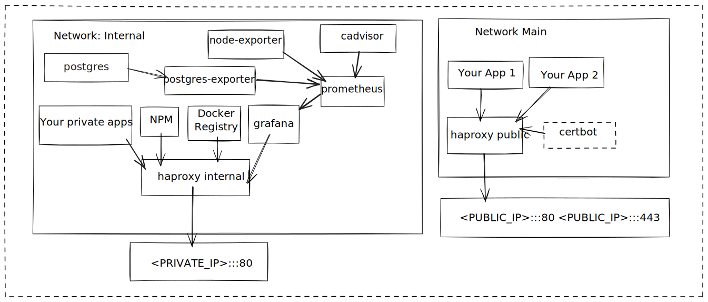

# Shoe-string cluster

This project is an attempt to create a turn-key "cluster" that is suitable for
small servers with limited RAM.

The only OS level dependencies it needs to be operated are `docker` and `docker-compose`
and I use it on a AWS Lightsail host with 1GB of RAM.

I wrote this after attempting to get "light weight" kubernetes environments going like K3s
or KIND, and finding that the resource overhead was simply too high for my requirements 
(`512mb` minimum, `1gb` recommended at time of writing)

**Current architecture**


## Guiding principals
- Every application runs in a `docker` container

- All configuration and data is stored under a single directory structure, to make backups simple

- Portable across different cloud providers, minimal host pre-requisites

- Provides the software that I typically want available to me when experimenting with personal projects 
  (eg: `npm` registry, `postgres` instance)

## Contributing
I welcome feedback and improvements, especially around any security concerns. However please note,
this project is pretty particular to my personal preferences and needs - I hope it might be of use
to others, but I might not accept PR's that don't align with my requirements. 

Please feel free to fork and customize to your hearts desire though :) 

## Features
- Public ingress on port 80 using haproxy

- Internal/private service ingress on port 8080 using haproxy

- Private Docker registry

- Private NPM registry

- Metrics collected by telegraf to influxdb, with grafana for dashboards

- Letsencrypt certbot for automatic SSL provisioning, and renewal

- "Watchdog" script suitable for running on demand, or as `CronJob` to reconcile
  running applications with the configuration on filesystem

- Helper scripts for updating application configuration with new docker tags to
  deploy

## Considerations
- Letsencrypt will ban domains that make invalid requests to its production environment
  it's worthwhile testing this part of things using their staging environment before running

- This is held together with string, a collection of bash scripts that may or may not be portable,
  it has been tested on Fedora 34 and AWS Linux 2.
  
## Setup
1. Clone repo to somewhere on host or otherwise place the contents on the server
2. Install `docker` / `docker-compose` (`./init/install-dependencies.sh`, or manually)
3. Create `config.sh` from `config.sh.example`
4. Bootstrap data/configuration structure using `./init/create-empty-configuration-structure.sh`
5. Configure initial applications in the created configuration structure, and adjust templates/config as needed
6. Run ./start.sh

## Usage / Scripts reference
There are a number of bash scripts in this project, I give a brief overview below,
but you should probably read through them before attempting to use in production.

### `./config.sh`
- Contains the path to the directory containing all configuration files, and other storage.
- Contains credentials to be used for things like `influxdb` and `postgres` users.

### `./start.sh`
- Generates haproxy configuration
- Creates the `main` docker network
- Start services defined in `docker-compose.yaml`
- Runs `watchdog.sh` to start applications configured in `applications`

### `./stop.sh`
- Stop services defined in `docker-compose.yaml`
- TODO: stop applications?

### `./proxy/reload-haproxy-config.sh`
- Called automatically by `start.sh` and ssl certificate scripts
- Re-generates `haproxy.cfg` files, and sends a signal to the containers to reload their config.
- Can be called manually if changes to the template or applications.js files have been made

### `./applications/watchdog.sh`
- Suitable for calling as a `CronJob` or manually after making changes to the `applications/*.sh`
  configuration files, attempts to reconcile running containers with the configuration state.

### `./appplications/deploy-new-version.sh`
Usage:
```shell
./appplications/deploy-new-version.sh <APPLICATION_NAME> <TAG>
```

Where `<APPLICATION_NAME>` is the name of a configuration file, and `<TAG>` is the new
desired `docker` tag to be executed.

### `./ssl/*`

TODO: write documentation

## Accessing internal services
The ingress on 8080 is intended to be private, ensure you have a firewall in place that
only allows http(s) traffic on 80/443

Currently, there is no SSL setup on the internal ingress, it is assumed that you will connect 
to this securely over a VPN or SSH tunnel for now.

The services are available via port 8080, with the domains configured in the `haproxy-internal/applications.js`
file. At this stage the easiest way to make this available in your browser is to add entries to your
hosts file, or use something like `dnsmasq`

Eg: `/etc/hosts` file
```shell
127.0.0.1   grafana.example.internal
127.0.0.1   npm.example.internal
127.0.0.1   docker.example.internal
```

## Core Services
There are a number of "core" services managed by `docker-compose`. This is distinct from application services
that you want to deploy and make available.

### Influxdb
This is a time series database used by `telegraf` / `grafana` to collect and display metrics
about the host system, and public proxy.

By default, authentication is disabled. For production environments it probably makes sense to enable
authentication, and adjust the `telegraf` / `grafana` configuration as appropriate.

You may wish to customise the rentention policy and add continous queries to downsample your data,
refer to https://docs.influxdata.com/influxdb/v1.7/guides/downsampling_and_retention/ for help with this.

Start a influx shell using:
```shell
docker exec -it monitoring_influxdb influx
```

### Telegraf
This is the agent that collects metrics from the system and stores them in `influxdb`.

The default configuration should be a good baseline, and you can of course configure this as
required after bootstrapping your instance, in `/path/to/config/telegraf/telegraf.conf`

Refer to the manual at https://docs.influxdata.com/telegraf/v1.18/administration/configuration/

### Grafana
At first start you will need to configure grafana with a connection to the influxdb datasource, and
create / import some dashboards.

Datasource configuration:
- URL: `http://influxdb:8086`
- Database: `telegraf`
- Authentication disabled by default, if you enabled it in the `docker-compose.yaml` file then
  use the username/password you specified in `config.sh`

I recommend importing these dashboards to get started:
- System: https://grafana.com/grafana/dashboards/5955
- Docker: https://grafana.com/grafana/dashboards/10585
- HAProxy: https://grafana.com/grafana/dashboards/2263

### HAProxy
There are two instances of haproxy in use, one for public ingress listening on port 80/443 on 
the host, and one for private/internal ingress listening on port 8080 on the host.

The configuration is generated from a template `haproxy.cfg.template` and a list of 
applications defined in `applications.js`

Any customizations you need to make should be made to the template rather to avoid them
being overwritten.

The public proxy exposes stats using a unix socket, mounted to `haproxy-public-stats` and 
read from by telegraf.

For the public ingress, SSL certificates are read from `haproxy-public-ssl`, noting that haproxy
requires the public and private portion to be stored in the same file.

Originals are managed by certbot and stored in `letsencrypt/etc`

### Docker Registry (`registry:2`)

TODO: write documentation

### NPM Registry (`verdaccio`)

TODO: write documentation
  
## Future / TODO
- wireguard setup to bind internal ingress to private ip/interface?
- find a way to allow issuing of SSL certs for private/internal services?
- selectively enable/disable core services, eg: `postgres`
